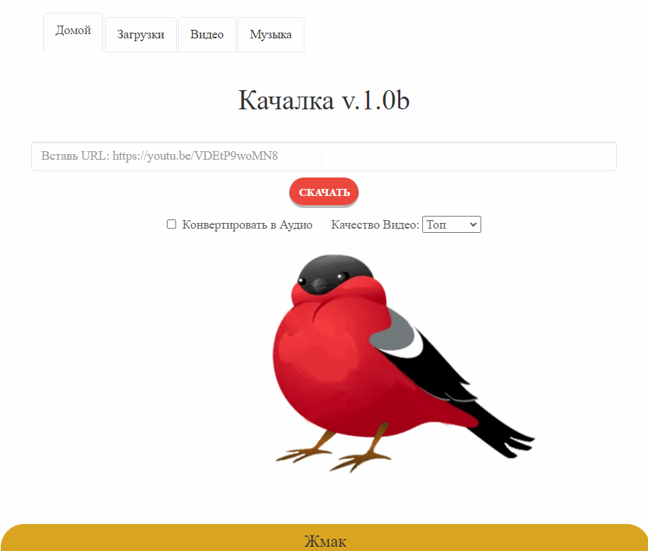

## Описание

Позволяет скачивать практически с любого ресурса видео.
- Конвертирует в mp4 и хранит на сервере.
- Есть возможность забрать аудиодорожку с видео.
- По умолчанию скачивается максимальное качество видео.
- Подходит для использования с устройствами на базе Win, macOS, Linux, Android, iOS.
- Удобен в качестве единой площадки для работы с контентом для SMM-групп и контент-маркетологов.

<p align="center">
    
</p>

## Как пользоваться
1. Вставить прямую ссылку в строку
2. Кнопка **СКАЧАТЬ**
3. Отследить что загрузка завершена
4. Перейти на вкладку **Видео**
5. Забрать файл

## Docker
_Предполагается что docker установлен и вы умеете пользоваться гуглом._

_Готовый образ забрать можно [тут](https://hub.docker.com/r/mikedigriz/yt)_

---
Установка:
```
git clone https://github.com/mikedigriz/YT.git && cd YT
docker build -t yt .
```
Запуск:
```
docker run -it -p 80:80 yt
```
Чистая пересборка:
```
docker build --no-cache -t yt .
```

## Рекомендации
- Если нет необходимости долго хранить файлы. В **cron** можно добавить автоматическое удаление.  
Пример скрипта тут: ```app/etc/Scripts```


- 'Из коробки' проблемы с именами файлов.  
При разворачивании контейнера на библиотеку **yt-dlp** накатывается измененный файл **_utils.py**.  
При внезапных поломках после обновлений - смотри туда.


- Когда нужен доступ с других устройств, вспомните про **route**.  
Для этого в командной строке ПК или настройках роутера добавьте маршрут.  
Пример для Windows:
```route add 172.17.0.0 mask 255.255.0.0 192.168.1.100```


- Если с ресурса перестало загружать - посмотрите на открытые [ишью библиотеки yt-dlp](https://github.com/yt-dlp/yt-dlp/issues).
## Баги бэка

- Скачивается видео без звука - проблема может быть в **yt-dlp** или **ffmpeg**. 
- Загрузка не начинается и во вкладках пусто - проблема с правами на каталог.
- Загрузка началась и упала с ошибкой - сайты меняются, а некоторые как YouTube - борется с загрузками.  
Проверить актуальность библиотеки **yt-dlp**. Проверить работает ли загрузка из консоли.

## Послесловие
Первоначально использовалось библиотека [youtube-dl](https://github.com/ytdl-org/youtube-dl).  
Но из-за того что библиотека брошена и не обновляется - сейчас используется ее форк [yt-dlp](https://github.com/yt-dlp/yt-dlp).  
Основной код написан не мной, я разобрался в кодовой базе и добавил изменения, дополнения, обновления компонентов, докер.

Автор оригинального кода [paste here].
