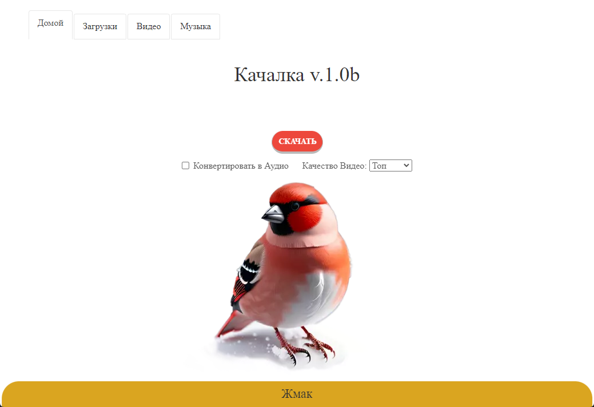

<div align="center">

# Качалка

**Вставляешь ссылку - получаешь готовый файл. Без рекламы, без регистрации, без мороки.**

[](https://hub.docker.com/r/mikedigriz/yt)
[](https://hub.docker.com/r/mikedigriz/yt)
[](https://github.com/mikedigriz/YT)
[](https://github.com/yt-dlp/yt-dlp)

</div>

## Что это и зачем

Качалка - это свой собственный маленький сервис для скачивания видео и музыки, который разворачивается на своём сервере одной командой Docker. Внутри работает [yt-dlp](https://github.com/yt-dlp/yt-dlp) - лучший из существующих загрузчиков, - а Качалка добавляет к нему удобную веб-страницу: очередь загрузок, вырезание рекламных вставок, перевод озвучки и обход блокировок.

Вставил ссылку - получил чистый mp4 или аудиофайл с уже встроенными обложкой и тегами. Никакой рекламы, никаких "скачать за 5 секунд, но сначала посмотрите баннер", никакой привязки к чужому серверу, который может закрыться или начать следить за тобой. Только твой сервер и то, что ты на нём разрешил.

<p align="center">
    
</p>

## Что умеет

- Скачивает видео и аудио практически с любого сайта, который умеет yt-dlp
- Автоматически вырезает спонсорские вставки на YouTube (SponsorBlock)
- Переводит закадровую озвучку иностранных видео на русский голосом Яндекса
- Обходит бот-проверку YouTube без кук и аккаунта Google
- Поддерживает SOCKS5-прокси для сайтов, заблокированных по региону
- Отдаёт готовый файл на телефон по QR-коду - навёл камеру и забрал
- Сам чистит за собой: старые файлы удаляются через пару часов

Полный список фич и мелких удобств - в [документации](docs/README.md).

## Попробовать за 2 минуты

Нужен только установленный Docker.

```bash
git clone https://github.com/mikedigriz/YT.git && cd YT
docker build -t yt .
docker run -it -p 8000:80 yt
```

Открой `http://localhost:8000`, вставь ссылку на видео и нажми **Скачать**.

Подробный туториал с настройкой `.env`, прокси и cron - в [docs/tutorials/01-pervyy-zapusk.md](docs/tutorials/01-pervyy-zapusk.md).

## Дальше

Вся документация разложена по четырём полкам - в зависимости от того, что тебе сейчас нужно:

- **[Туториал](docs/tutorials/01-pervyy-zapusk.md)** - если видишь Качалку первый раз и хочешь пройти путь от нуля до скачанного файла.
- **[How-to](docs/how-to)** - если нужен конкретный рецепт: настроить прокси, включить перевод, обновить yt-dlp, поставить сайт за HTTPS.
- **[Справочник](docs/reference)** - если нужны точные цифры: параметры конфига, коды ошибок, структура проекта.
- **[Объяснения](docs/explanation)** - если интересно, как всё устроено внутри и почему сделано именно так.

Полная карта - в [docs/README.md](docs/README.md).

## Лицензия

MIT, см. [LICENSE](LICENSE).
